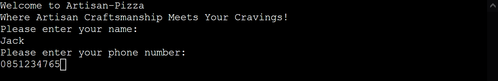
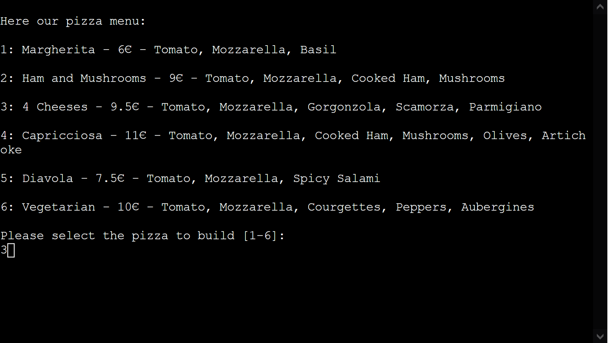
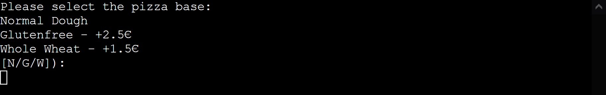
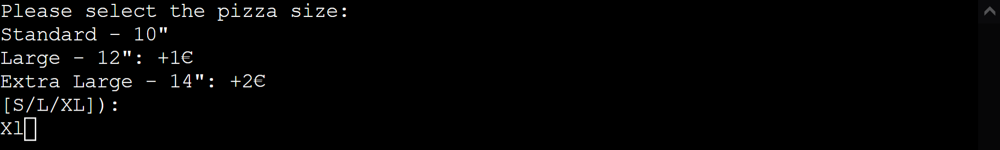
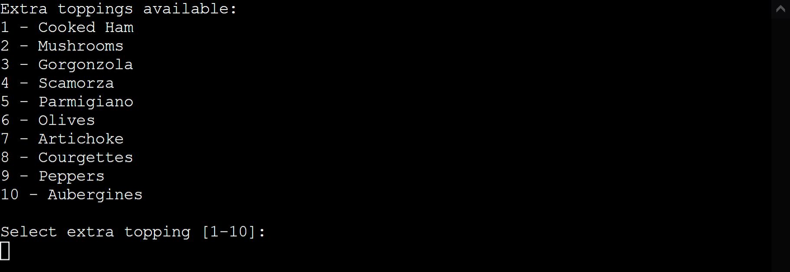
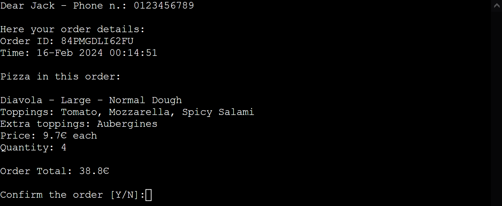

# Artisan Pizza

Artisan pizza is a place where Pizza Chef prepare your favorite original Italian pizza, using the most delicious ingredients. 

This ordering system app will help the users selecting from a pizza menu or customize a pizza. 
The goal for the owner is to have access to the menu via Google Sheet as well as see all the orders placed there on a simple and intuitive GUI.

[Visit the live website link](https://artisanpizza-e12e243b6fd4.herokuapp.com/)

# UX

There are a lot of ways to approach an ordering system for a Pizza restaurant below you can find the considerations I put together.

## User stories

As pizza restaurant customer:
- Provide Name and Phone number 
- View the menu
- Choose the pizza without much typing
- Choose the pizza base/dough and size
- Add extra toppings if I'd like to customize my pizza
- Add the pizza to my order
- Being able to add multiple pizza in a single order
- View the whole order once I completed
- Get an order reference ID

As pizza restaurant ower: 
- Provide an easy way for customers to order pizza
- Being able to modify Menu in an easy way via a GUI like Google Sheet
- Being able to see all the placed orders

## App Workflow

I used [Diagrams.net](https://app.diagrams.net/) to create the application worlfow to have a guideline in terms of which functions I had to implement. Almost every block correspond to a defined function.

# Data Structure - Google Sheet

I decided to integrate the application with Google sheet to have a place to load the menu and to save the orders.

## Menu Worksheet

Each column correspond to a Pizza, and last column is used for the Extra toppings.
A menu fuction has been implemented to load each column in a list using gspread related methods.

Here how the menu is structured:
- Row-1 - This heading is used as index/pizza ID [or extra toppings]
- Row-2 - This represent the Pizza name
- Row-3 - This is the price set for each pizza
- Row-4 - From this row on each column we've all the included toppings, and for last column all the extra toppings

## Orders Worksheet

As the name says, this worksheet is used to store the data related to the orders, so the owner can see what to prepare, with an order ID, time and all the data related to pizza and related customization in terms of base, size and extra toppings with the total price for each pizza and related quantity. 
An order is identified by an ID and can have multiple rows corresponding to a specific pizza.

# Features

## Existing Features

### Welcome
Welcome function to greet the customer and gather Name and Phone number

### Welcome
The menu is loaded via API from Google Sheet after getting Name and Number.
The user can see the Pizza list, related price and included toppings and select which pizza to order

### Pizza Base
The user can select between 3 different base, extra price is showed for special ones 

### Pizza Size
The user can select pizza size, with Large or Extra Large costing extra

### Pizza Extra Toppings Choice
The user can choice to add extra toppings or not to the selected pizza  

### Pizza Extra Toppings Menu
In case the user select Y to the previous function, the extra toppings menu shows up and additional ingredients can be added to the pizza  

### Select Quantity
After adding all the desired extra toppings, the user can select how many pizza to add on the order 

### Adding Another Pizza
After confirming the number of pizza, the user can choose to select anothre pizza to be added to current order  

### Order confirmation
Once the user is done with all the pizza in the order, the full order details is displayed and required confirmation to proceed with sending it to the kitchen. After confirmation or cancellation the application starts over from the Welcome feature.

## Future Features
- Allow to remove toppings
- Send text message to confirm the order
- Send text message to inform the order is ready

# Technologies Used

## Languages Used
Python

## Frameworks, Tools and Resources Used
- Google Sheet to load and store the data
- [Diagrams.net](https://app.diagrams.net/) to create the application worlfow 
- [Git](https://git-scm.com/) - code version control
- [Github](https://github.com/) - repository for al the site files
- [Gitpod](https://gitpod.io/) - IDE platform
- [Pythontutor](https://pythontutor.com) - to check visually how a data structure was built
- [CI Python Linter Validation](https://pep8ci.herokuapp.com/) - to validate PEP8 syntax
- [Heroku](https://www.heroku.com/) - cloud service where I deployed the application
- [Markdown Tables Generator](https://www.tablesgenerator.com/markdown_tables) - to convert tables to MD for the testing.md page

## Python Libraries Used
- [Datetime](https://docs.python.org/3/library/datetime.html) generate the timestamp added to the order
- [Short UUID](https://pypi.org/project/shortuuid/) for generating an unique order ID
- [google.oauth2.service_account](https://developers.google.com/identity/protocols/oauth2/service-account) for authenticating with Google API
- [Gspread](https://docs.gspread.org/en/latest/) to interact with Goolge API for loading and saving data

## Testing

### Manual Testing 
Please refer to  page for the performed tests.

### Known Bugs
While implementing the select_pizza_base function I faced this syntax error after deploying on Heroku, while on Gitpod everything was working fine:  

After investigating, I found out GitPod uses python-3.12.1 while Heroku was running python-3.9.18  
The select_pizza_base function has match/case syntax supported starting from version 3.10  
Fix: udpate runtime.txt to use python-3.12.1  

No further bugs have been found during the implementation, deployment and testing.

## Deployment

Code has been developed using Gitpod, cloing the Code Institue's Template which integrate a terminal for Heroku.

### Set up Google API
Credits to [Delboy](https://github.com/Delboy/Fruit-Hunter) for these detailed instructions:

To set up google sheets API you must:
1. Head to https://console.cloud.google.com/ and sign in or create a free google account.
2. From the google cloud platform dashboard click 'Select a new project'. Then select 'New project'.
3. Create a name for your project under 'Project name' then click 'Create'.
4. This should bring up a box with your project in. Underneath click 'SELECT PROJECT'.
5. From the sidebar navigate to 'APIs and services', 'Library'.
6. In the search bar search for google drive.
7. Select 'Google drive API' and click 'ENABLE'.
8. Click the 'CREATE CREDENTIALS' button located to the top right of the page.
9. From the dropdown menu under 'Which API are you using?' select 'Google drive API'.
10. Under 'What data will you be accessing' choose 'Application data'.
11. Under 'Are you planning to use this API with Compute Engine, Kubernetes Engine, App Engine or Cloud Functions?' select 'No, i'm not using them' and click 'NEXT'.
12. Enter a Service Account Name. You can name it whatever you like. I would suggest naming it the same as what you named your project. Then click 'CREATE AND CONTINUE'.
13. In the 'Role' dropdown menu select 'Basic', 'Editor', then click 'Continue'.
14. The next page can be left blank so just click 'DONE'.
15. Under 'Service Accounts' find the account you just created and click it.
16. Navigate to the 'KEYS' tab and click 'ADD KEY', 'Create new key'. Select 'JSON' and click 'CREATE'.
17. This will download a json file to your machine. This normally downloads into your 'downloads' folder but if you're unsure you can right click the file once it's downloaded and click 'show in folder' to locate it.
18. Next we will have to link the Google Sheets API. To do this navigate back to the library by clicking on the burger icon in the top left hand corner and selecting 'APIs and services', 'Library' from the dropdown menu.
19. In the search bar search for 'Google Sheets' and select 'Google Sheets API' and click 'ENABLE'.
20. Now, using a programme like Gitpod open or create a repository.
21. Drag and drop the json file that you downloaded earlier into your workspace. Rename this file to 'creds.json'.
22. Open the file and copy the email address under 'client_email' without the quotation marks.
23. Open up the google sheet you want to use and click the 'Share' button.
24. Paste in the client email. Make sure 'Editor' is selected, untick 'Notify people' and then click 'Share'.
25. To protect sensitive information be sure to add your creds.json file to your .gitignore file inside your editor.
26. In order to use our google sheets API you need to install two additional dependencies into your project. To do this, inside your python workspace on the first line input 'import gspread' and on the line beneath input 'from google.oauth2.service_account import Credentials'.
27. Underneath the two imports copy and paste this code, inserting the name of your google spreadsheet where it says 'google_sheet_name_here'.

    SCOPE = [
        "https://www.googleapis.com/auth/spreadsheets",
        "https://www.googleapis.com/auth/drive.file",
        "https://www.googleapis.com/auth/drive"
        ]

    CREDS = Credentials.from_service_account_file('creds.json')
    SCOPED_CREDS = CREDS.with_scopes(SCOPE)
    GSPREAD_CLIENT = gspread.authorize(SCOPED_CREDS)
    SHEET = GSPREAD_CLIENT.open('google_sheet_name_here')

28. Your APIs will now be linked to your project.

### Setting up Heroku
Credits to [Delboy](https://github.com/Delboy/Fruit-Hunter) for these detailed instructions:

To set up heroku you must:
1. If your requirements.txt file has not changed you can skip this step. Otherwise, in your terminal type 'pip3 freeze > requirements.txt' then save and push the changes.
2. Go to Heroku.com and sign in or create a free account.
3. From the heroku dashboard click the 'Create new app' button.
4. Name the app something unique and choose what region you are in then click 'Create app'.
5. Go to the settings tab and find the Config Vars section. Click 'Reveal Config Vars'.
6. If your project does not use a creds.json file then skip this step. Otherwise, in the field for KEY enter the value CREDS in all capitals. In the field for VALUE copy and paste the entire contents of your creds.json file from your project. Then click 'Add'.
7. In the field for KEY enter PORT in all capitals, then in the field for VALUE enter 8000. Then click 'Add'.
8. Scroll down to the Buildpacks section and click 'Add buildpack'.
9. Click Python then save changes.
10. Add another buildpack by clicking 'Add buildpack' and this time click Nodejs then save changes.
11. Make sure that Python appears above Nodejs in the buildpack section. If it does not you can click and drag them to change the order.
12. Then head over to the deploy section by clicking deploy from the nav bar at the top of the page.
13. From the 'Deployment method' section select GitHub and click 'Connect to GitHub'.
14. Enter the repository name as it is in GitHub and click 'search'.
15. Click the 'connect' button next to the repository to link it to heroku.
16. To deploy, scroll down and click the 'Deploy Branch' button.
17. Heroku will notify you that the app was successfully deployed with a button to view the app.
18. If you want to rebuild your app automatically you can also select the 'Enable Automatic Deploys' button which will then rebuild the app every time you push any changes.

### How to Clone

To clone the repository:
1. Log in (or sign up) to GitHub.
2. Go to the repository for this project, [ArtisanPizza](https://github.com/claudiosarto/artisan-pizza)
3. Click on the code button, select whether you would like to clone with HTTPS, SSH or GitHub CLI and copy the link shown.
4. Open the terminal in your code editor and change the current working directory to the location you want to use for the cloned directory.
5. Type 'git clone' into the terminal and then paste the link you copied in step 3. Press enter.

### How to Fork

To fork the repository:
1. Log in (or sign up) to Github.
2. Go to the repository for this project, [ArtisanPizza](https://github.com/claudiosarto/artisan-pizza)
3. Click the Fork button in the top right corner.

### Credits
Credits to [Delboy](https://github.com/Delboy/Fruit-Hunter) for the readme sections related to Setting up Google API and Heroku deployment

I used extensively  Stackoverflow.com](https://stackoverflow.com/) to figure out the syntax of various functions.

### Acknowledgments
I'd like to thank my mentor Jubril Akolade for giving me hints and tips during the project.